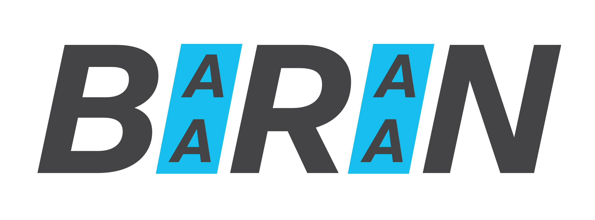

[](https://github.com/amirmasoudabdol/baaraan/actions?query=workflow%3AmacOS)
[](https://github.com/amirmasoudabdol/baaraan/actions?query=workflow%3AUbuntu)



> 🚨 **Disclaimer:** I am in the process of testing and open-sourcing baaraan, please do not use it in production unless you have done the test yourself! 

# Baaraan

Baaraan (Farsi: باران, [_baran_](https://en.wiktionary.org/wiki/باران), | bârân |) is a collection of missing multivariate random number distributions for Modern C++ with [STL](https://en.cppreference.com/w/cpp/numeric/random)-like API. For the start, some of the more important and useful distributions are implemented and tests, e.g., Multivariate Normal Distribution, and I am hopping to slowly expand the list of the distributions, and maybe even add some noise functions to the library as well.


For the most part, Baaraan's random number distributions are sharing the same interface and implementation details as their STL counterparts. First advantages of this is that they will look and behave very familiar. Moreover, they can adapt to your setup, for example, they will work with different URNGs out of the box. 

I use [Armadillo](http://arma.sourceforge.net) as the backend Linear Algebra library. Mainly, I'm using `arma::vec` and `arma::mat` as default `VectorType`  and `MatrixType` types. This is shared between all multi-variate distributions.

For the actual probability distribution implementation, i.e., density, probability, cumulative functions, I am planning to use [Boost](https://www.boost.org/doc/libs/1_62_0/libs/math/doc/html/math_toolkit/dist_ref.html) architecture and interface. Boost uses several [non-member functions](https://www.boost.org/doc/libs/1_62_0/libs/math/doc/html/math_toolkit/dist_ref/nmp.html) are being used to query different properties of a distribution.

## Available Distributions

**Multivariate:**
- [Multivariate Normal](https://en.wikipedia.org/wiki/Multivariate_normal_distribution)
- [Multivariate t-Student Distibution](https://en.wikipedia.org/wiki/Multivariate_t-distribution?wprov=sfti1)


**Truncated:**
- [Truncated Normal](https://en.wikipedia.org/wiki/Truncated_normal_distribution)
- [Truncated Multivariate Normal](https://en.wikipedia.org/wiki/Truncated_normal_distribution)


**Rectified:**
- [Rectified Normal](https://en.wikipedia.org/wiki/Rectified_Gaussian_distribution)

## Installation

Alternatively, you can build and install baaraan first, and use CMake's `find_package` command to add it to your project:

```bash
git clone https://github.com/amirmasoudabdol/baaraan
cd baaraan; mkdir build; cd build
cmake .. && make
make install
```

Now, you can simply use the `find_package` and if everything is setup correctly, you should be able to compile your projects and use baaraan in your project.

```cmake
find_package(baaraan)

# don't forget to link it to your executable or library
target_link_libraries(your-project baaraan) 
```

## Example

After installing and linking baaraan to your project, you should be able to simply `#include` any distributions and use it as follow:

```cpp
#include <iostream>
#include "baaraan/dists/mvnorm_distribution.h"

using namespace baaraan;

int main(int argc, char const *argv[])
{
	arma::vec means {1, 2, 3};
	arma::mat sigma{{1, 0, 0}, {0, 1, 0}, {0, 0, 1}};

	std::mt19937 gen(42);
	mvnorm_distribution<double> mvnorm{means, sigma};

	std::cout << mvnorm(gen) << std::endl;

	return 0;
}
```

Your `CMakeLists.txt` should look something like this:

```cmake
cmake_minimum_required(VERSION 3.20)
project(rain)

set(CMAKE_CXX_STANDARD 14)

find_package(baaraan)

add_executable(rain main.cpp)
target_link_libraries(rain baaraan)
```


# Misc.

## TODO

- [ ] Implement more tests
- [ ] Implement more distributions
- [ ] Add more documentations
- [ ] Add more examples

## Support

If you enjoy using `baaraan`, please consider supporting it on [GitHub](https://github.com/sponsors/amirmasoudabdol). You can sponsor me monthly, or make a one-time donation! 🤗